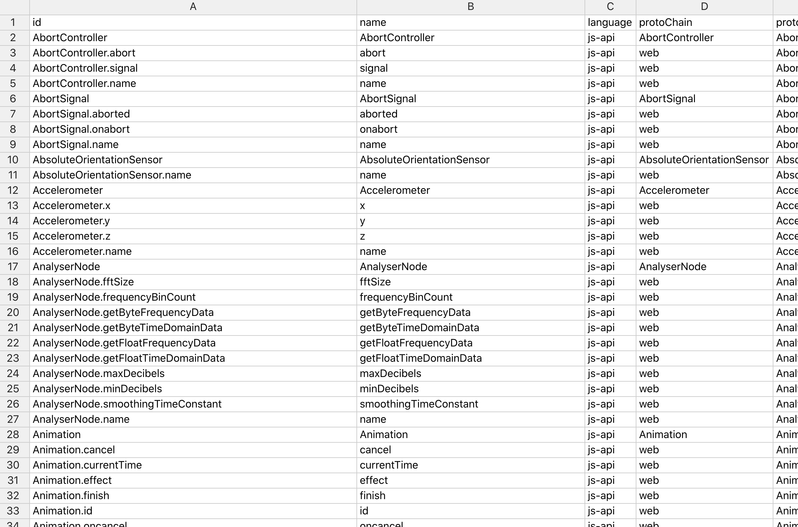

compat-browser
==============

A compat records viewer for [ast-metadata-inferer](https://github.com/amilajack/ast-metadata-inferer)



## Local Setup

```bash
git clone https://github.com/amilajack/compat-browser
cd compat-browser
yarn
yarn start
```

## Future

Eventually this project will be merged into the [compat-db](https://github.com/amilajack/compat-db) monorepo

## Related

* [eslint-plugin-compat](https://github.com/amilajack/eslint-plugin-compat)
* [ast-metadata-inferer](https://github.com/amilajack/ast-metadata-inferer)
* [compat-db](https://github.com/amilajack/compat-db)
